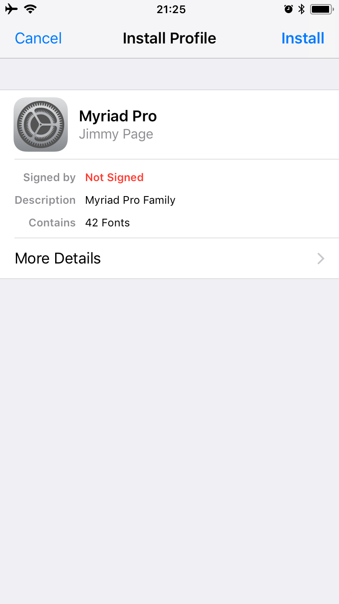
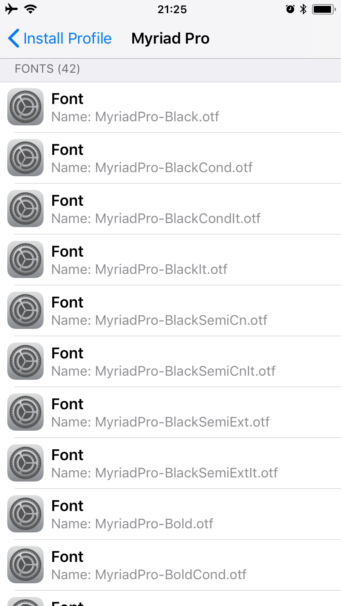

# iOS Font Profile Generator
This generator converts font files to font profiles for iOS or macOS.

## Installation
### Homebrew
`brew install jimmymasaru/repo/fp-gen`

## License
MIT

## Usage
- It is highly recommended that multiple CJK (Chinese, Japanese or Korean) fonts should not be wrapped in a single font profile.
- Do not try to convert TTC font files since they are not supported through font profiles on iOS or macOS. You can extract TTF/OTF from TTC by [AFDKO](https://github.com/adobe-type-tools/afdko).
```
fpgen <font> [<font2> <font3> ...] -o <output.mobileconfig> -n <font name> -d <font description> --org <organisation>
fpgen ~/Documents/MyriadPro -o MyriadPro.mobileconfig -n "Myriad Pro" -d "Myriad Pro Family" -org "Jimmy Page"
```
### Output
The converted font profiles can be either mailed or sent via AirDrop to your iOS devices. The screenshots below show how a font profile looks on an iOS device. Apple Configurator 2 can deploy a font profile as well and you do not have to tap any buttons on your devices. Please note that opening a font profile (.mobileconfig) through any kinds of iOS file managers would not work.





## Future Plans
No functional changes.
- Async Methods
- Stream Pipe
